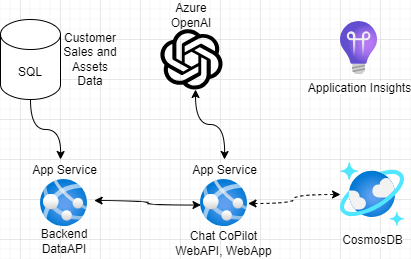
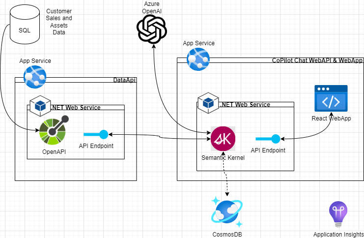

# Chat Copilot with Structured Customer Sales Data

This purpose of this sample application is to illustrate how to build a custom AI CoPilot application to chat with structured customer and sales data that would typically be found in a Sales CRM application. 

This project utilizes the [Chat Copilot Sample Application](https://github.com/microsoft/chat-copilot) as a starting point, which uses a RAG pattern with unstructured data in AISearch (or similar) to allow you to chat with data in documents, with the following high-level components:

* [WebApp](./webapp/) - React-based web client application to host the CoPilot chat experience
* [WebAPI](./webapi/) - OpenAPI endpoint that executes the backend OpenAI orchestration, using the [Semantic Kernel SDK](https://github.com/microsoft/semantic-kernel)

This project adds the following additional components: 

* [DataAPI](./dataapi/) - OpenAPI endpoint registered with the Semantic Kernel agent as an additional plugin that can be used by the LLM to answer questions about customer data. The DataApi is modeled after a few data sets from a Customer Relationship Management (CRM) system containing customer asset and and sales data, but could easily replaced with any OpenAPI with a well documented swagger definition.
* [SQL Database](./scripts/deploy/database/sqlserver/) - deployment templates and scripts for an Azure SQL backend database with sample data exposed via the DataAPI.

# Architecture
This open-source sample application is intended for use as an education tool or solution accelerator. The deployment scripts included will deploy the below basic infrastructure, where the CosmosDB is an optional component for persisting chat session history. 

## Dev Architecture

This project includes .NET Web Services and utilizes the Semantic Kernel SDK for backend orchestration. The front end is a react web application.

## Logical Flow

Below describes the basic logical flow for each chat turn in a session:

1. The user asks a question of CoPilot in the chat window.
2. This question along with other session information is sent to the backend WebAPI.
3. The Chat controller assembles the below, and uses a Semantic Kernel instance to send to the OpenAI LLM.
    * User intent (question)
    * All chat history from the session
    * A list of all available Kernel Functions available to help answer the question (including the DataAPI functions) with descriptions
    * A Prompt to instruct the model on the expected response based on data and logic available in the Functions
4. The model then instructs Semantic Kernel which functions to execute in order, to retrieve data needed to answer the question. This is using an OpenAI feature called [Function Calling](https://platform.openai.com/docs/guides/function-calling).
    * In this project, [Automatic Function Calling](https://learn.microsoft.com/en-us/semantic-kernel/agents/plugins/using-the-kernelfunction-decorator?tabs=Csharp#allow-the-ai-to-automatically-call-your-function) has been enabled in the Kernel so that these instructions are carried out without human-in-the-loop intervention required. 
5. The Kernel then executes the function calls, including requests to the DataAPI to retrieve the relevant customer data, and sends the results back to the model. This is an example of a [RAG (retrieval augmented generation) Pattern](https://help.openai.com/en/articles/8868588-retrieval-augmented-generation-rag-and-semantic-search-for-gpts), but with structured data query endpoints rather than a semantic search. 
6. The model constructs an answer - based on the provided data, prompt and history  context - and sends it back to the Kernel, which is assembled with other response infromation and returned to the front end web app, where the answer is displayed. 

## References:
* [Chat CoPilot: A reference application for Semantic Kernel](https://learn.microsoft.com/en-us/semantic-kernel/chat-copilot/)
* [Chat CoPilot: Github](https://github.com/microsoft/chat-copilot)
* [OpenAI Platform - Function Calling](https://platform.openai.com/docs/guides/function-calling)
* [Semantic Kernel SDK](https://github.com/microsoft/semantic-kernel)
* [Semantic Kernel - Understanding AI plugins and functions](https://learn.microsoft.com/en-us/semantic-kernel/agents/plugins)
    * [Allow the AI to automatically call your function](https://learn.microsoft.com/en-us/semantic-kernel/agents/plugins/using-the-kernelfunction-decorator?tabs=Csharp#allow-the-ai-to-automatically-call-your-function)
* [OpenAI Articles - Retrieval Augmented Generation (RAG) and Semantic Search for GPTs](https://help.openai.com/en/articles/8868588-retrieval-augmented-generation-rag-and-semantic-search-for-gpts)

# Try it out!

For demo or learning purposes, if you simply want to get this solution running on your local machine, follow the `Run Locally` steps below. 

For instructions to deploy this solution template to the cloud in your Azure subscription, follow the instructions found at [/scripts/deploy/README.md](./scripts/deploy/README.md). 

## Run Locally

Utilize the quick-start instructions to run the Chat Copilot Sample Application this project is built on found on the official Chat CoPilot Microsoft Learn [getting started](https://learn.microsoft.com/semantic-kernel/chat-copilot/getting-started) page.

> A copy of these instructions published at the time of cloning can be found [here](/docs/ChatCoPilotQuickStart_May2024.md) in the event that the official getting started page gets significant updates after the creation of this project.

In short, [the instructions](https://learn.microsoft.com/semantic-kernel/chat-copilot/getting-started) should help you to:

1. Clone this repository
2. Setup your local environment with pre-requisites
3. Configure app settings for Azure OpenAI connection
    * Existing Azure OpenAI or OpenAI deployment endpoint is required for this application.
4. Run the backend APIs and front end webapp locally

### Important Variations and Notes

1. This project adds an additional backend .NET web service that provides the DataAPI endpoint for retrieving the sales data for the LLM to reason over and answer questions. 
    * Requires [.NET 8 SDK](https://dotnet.microsoft.com/en-us/download/dotnet/8.0), which will not currently be installed by the setup scripts referenced by the [getting started](https://learn.microsoft.com/semantic-kernel/chat-copilot/getting-started) instructions.
    * Has been added to the [Start.ps1](./scripts/Start.ps1) script referenced in the [getting started](https://learn.microsoft.com/semantic-kernel/chat-copilot/getting-started) instructions. No additional steps will be required to build and run the DataAPI. 
    * DataAPI assumes a backend SQL database for data storage. If running locally without one, DataApi will run and can be called successfully, but no data will be returned.
    * See [DataAPI README](./dataapi/README.md) for more information
2. The backend WebAPI in this project uses .NET 6 rather than .NET 7
3. Certain 'educational' features and tabs have been disabled in the web app, including:
    * Plugin setup
    * Profile setup
4. The 'Document' tab in the web app, and the ability to upload discrete documents, has not been disabled in the WebApp, but will not be used or visible to the model with the current configuration of Kernel Memory in the WebAPI. 

## Trademarks

This project may contain trademarks or logos for projects, products, or services. Authorized use of Microsoft
trademarks or logos is subject to and must follow
[Microsoft's Trademark & Brand Guidelines](https://www.microsoft.com/en-us/legal/intellectualproperty/trademarks/usage/general).
Use of Microsoft trademarks or logos in modified versions of this project must not cause confusion or imply Microsoft sponsorship.
Any use of third-party trademarks or logos are subject to those third-party's policies.
